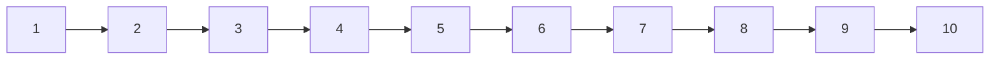

# General overview

# Custom Components

## [React Awesome Slider](https://caferati.me/demo/react-awesome-slider/autoplay) for showing all skills: Dev, CI/CD, Testing etc.

## [MUI Hover Card](https://codesandbox.io/s/37062176-material-ui-how-to-animate-card-zdepth-on-hover-element-react-2f9em?file=/demo.tsx) for showing the technologies
(Note: if adding experiences, add a date when I started using it and it will calculate the years/months)

## [Animated Circular Progress Bar](https://commerce.nearform.com/open-source/victory/gallery) for showing 100% stack coverage (basic skills)

## [Formik](https://github.com/jaredpalmer/formik) for forms like guestbook, contact, etc.

## Making a dropdown for the workflow explaination

# Website layout

### Welcome with background video. Video should have scroll effect

### Skills slider

### Code box with examples for skills

### Career tree
Switching left and right screen, every project and career step is explained (also private project)

### Contact me!

### Guestbook

# Workflow

1. Getting an idea

2. Illustrating the idea

3. Making a new branch

4. Writing the tests for the feature and developing it

5. Verifying the feature on my machine

6. Making a PR. This will trigger the tests to run. If everything goes well, a Docker Image is pushed and deployed to the server. A dev version is automatically created

7. Making sure the dev version works

8. Merging to the dev branch. This will build and push a staging version

9. After verifying the staging version for stability and functionality, merge to main

10. If all tests pass on PR to main, the feature will be deployed on the main branch

# Scratch book

